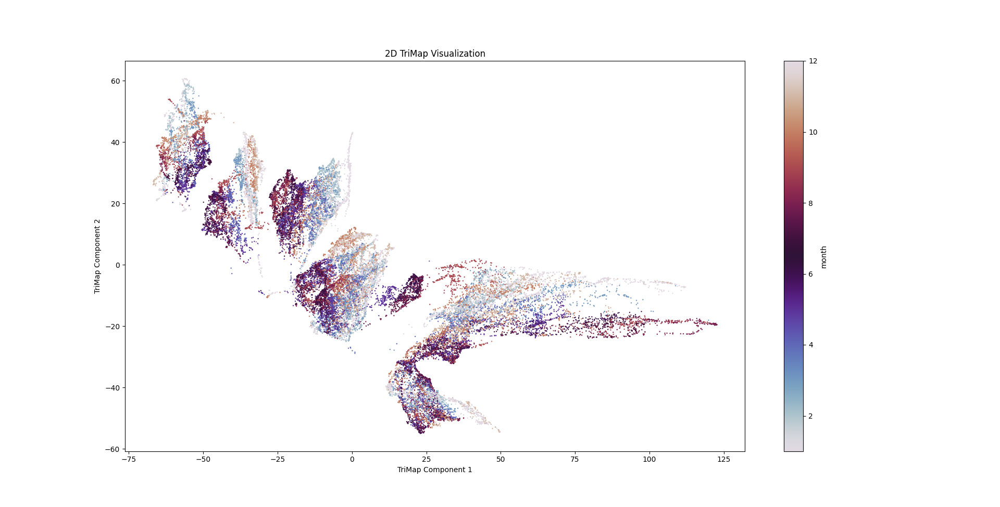

# Data-Challenges-2024WISE #
This repository contains the code and resources for the Data Challenge Course 24/25

- Code for [to create these Images](dimension_reduction/main.py)
- Folder for the [Images](images)

## Example Images ##
### Correlations ###

  

### Dimension Reduction TriMap ###

  
  

### Clustering PacMap ###

  
  

### Time Series ###

  
  

